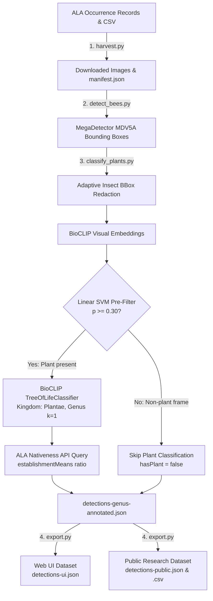

# Mining Ecological Relations: Pollinator-Plant Interaction Extraction

[](https://www.python.org/downloads/)
[](https://imageomics.github.io/bioclip-2/)
[](https://github.com/agentmorris/MegaDetector)
[](https://www.ala.org.au/)

Extract ecological relationships (pollinator-plant interactions) from community biodiversity records. This repository implements an automated computer vision and data mining pipeline that processes occurrence records and photographs from the **Atlas of Living Australia (ALA)** to detect, identify, and annotate the floral hosts visited by Australian native and introduced bees.

---

## Architecture & Pipeline Workflow



### Pipeline Stages

1. **Image & Metadata Harvesting (`pipeline/harvest.py`)**  
   Reads occurrence data exported from ALA, parses canonical image IDs, and downloads images with polite rate limiting and exponential backoff retry logic.

2. **Insect Localization (`pipeline/detect_bees.py`)**  
   Uses **MegaDetector (MDV5A)** batch inference to locate animals/insects within each photograph and save normalized bounding box coordinates.

3. **Insect Redaction, Plant Filtering & Classification (`pipeline/classify_plants.py`)**  
   - **Adaptive Bounding Box Redaction:** Filters out low-confidence detections ($< 0.25$) and oversized boxes ($> 0.50$ of image area), then applies an adaptive Gaussian blur proportional to box dimensions.
   - **SVM Plant Gate:** Extracts normalized BioCLIP visual embeddings and evaluates a calibrated Linear SVM pre-filter. If the probability of an identifiable floral plant in frame is $< 0.30$, genus classification is skipped to eliminate false positive plant hallucinations (e.g., insect body parts matching *Tetradium* or *Stelis*).
   - **BioCLIP Genus Classification:** Passes plant-positive blurred images through `TreeOfLifeClassifier` constrained to `Kingdom: Plantae` at `Rank.GENUS` ($k=1$).
   - **ALA Nativeness Annotation:** Queries the ALA `establishmentMeans` facet for the top plant genus with caching to compute the empirical native ratio in Australia:
     $$\text{nativeStatus} = \frac{N_{\text{native}}}{N_{\text{native}} + N_{\text{introduced}}}$$

4. **Dual-Mode Data Export (`pipeline/export.py`)**  
   Produces separate, optimized deliverables for client-side web interfaces and open-science research reuse.

---

## Installation

### Prerequisites
- Python 3.10 or higher
- PyTorch with Apple Silicon MPS (`torch.backends.mps.is_available()`) or CUDA GPU support

```bash
# Clone the repository
git clone https://github.com/<your-username>/miningRelations.git
cd miningRelations

# Create and activate virtual environment
python3 -m venv .venv
source .venv/bin/activate

# Install dependencies
pip install -r requirements.txt
```

---

## Quickstart & CLI Usage

A unified CLI runner is provided via `run_pipeline.py`.

### 1. Run the Demo Pipeline (with Sample Data)
The repository includes `sample_data/records.csv` (50 representative occurrences across 15 native and introduced bee genera). You can run a self-contained test of the entire pipeline end-to-end:

```bash
python run_pipeline.py all --csv-path sample_data/records.csv --output-dir sample_data/demo --limit 5
```

### 2. Run Full Pipeline End-to-End
```bash
python run_pipeline.py all --csv-path data/SEHbees/records.csv --output-dir data/SEHbees
```

### 3. Run Individual Steps

#### Step 1: Harvest Images & Build Manifest
```bash
python run_pipeline.py harvest \
  --csv-path data/SEHbees/records.csv \
  --output-dir data/SEHbees/images \
  --manifest-path data/SEHbees/manifest.json \
  --delay 0.5
```

#### Step 2: MegaDetector Animal Detection
```bash
python run_pipeline.py detect \
  --image-dir data/SEHbees/images \
  --output-path data/SEHbees/bbox_detections.json \
  --model MDV5A
```

#### Step 3: Redact Bees, Filter Plants & Classify Genera
```bash
python run_pipeline.py classify \
  --manifest data/SEHbees/manifest.json \
  --bbox-file data/SEHbees/bbox_detections.json \
  --images-dir data/SEHbees/images \
  --svm-model models/plant_filter_svm.joblib \
  --threshold 0.30 \
  --output-path data/SEHbees/detections-genus-annotated.json
```

#### Step 4: Export Clean Datasets (Web UI & Public Formats)
```bash
python run_pipeline.py export \
  --input-json data/SEHbees/detections-genus-annotated.json \
  --output-dir data/SEHbees \
  --min-confidence 0.4 \
  --decimals 4
```

---

## Data Output Formats & Data Dictionary

### 1. Web UI Deliverable (`detections-ui.json`)
Engineered specifically for client-side web applications. Automatically filtered to plant detections with prediction confidence $> 0.4$ (configurable via `--min-confidence`). All local paths, redundant arrays, and unused spatial coordinates are stripped, and floating-point confidence values are rounded to 4 decimals (reducing file size from ~14 MB to **~1.6 MB**):

```json
{
  "occurrenceID": "18258d3a-219e-41a2-93ae-b4912134a805",
  "scientificName": "Apis (Apis) mellifera",
  "genus": "Apis",
  "family": "Apidae",
  "imageID": "7f858a9f-0bf2-4702-a1d5-468ac9bde2a3",
  "eventDate": "2014-09-15T04:39:00Z",
  "dataResourceName": "ClimateWatch",
  "identifiedBy": "",
  "hasPlant": true,
  "plantConfidence": 0.7528,
  "plantDetection": {
    "genus": "Prunus",
    "score": 0.9457,
    "nativeStatus": 0.0043
  }
}
```

### 2. Public Research Deliverable (`detections-public.csv` & `detections-public.json`)
Darwin Core and FAIR-aligned format suitable for ecological research, GIS mapping, and statistical analysis:

| Field | Type | Description |
| :--- | :--- | :--- |
| `occurrenceID` | string | Unique ALA occurrence UUID |
| `scientificName` | string | Recorded insect taxon name |
| `beeGenus` | string | Insect genus |
| `beeFamily` | string | Insect family |
| `eventDate` | ISO 8601 | Date and time of observation |
| `decimalLatitude` | float | WGS84 latitude coordinate |
| `decimalLongitude` | float | WGS84 longitude coordinate |
| `imageID` | string | ALA image identifier |
| `imageUrl` | string | Canonical public image URL (`https://images.ala.org.au/image/{imageID}`) |
| `dataResourceName` | string | ALA contributing dataset / citizen science provider |
| `identifiedBy` | string | Observer / identifier credit |
| `boxesRedacted` | integer | Number of MegaDetector bounding boxes redacted in image |
| `hasPlant` | boolean | Binary plant presence decision from calibrated SVM gate |
| `plantFilterConfidence` | float (0–1) | Calibrated probability of plant presence from visual embedding SVM |
| `plantGenus` | string | Top-ranked plant genus predicted by BioCLIP |
| `plantGenusScore` | float (0–1) | BioCLIP model prediction confidence |
| `plantGenusNativeStatus`| float (0–1) | Ratio of ALA Australian records flagged as native vs introduced |

---

## Repository Structure

```
├── pipeline/                   # Modular pipeline package
│   ├── __init__.py
│   ├── harvest.py              # Step 1: ALA Harvester
│   ├── detect_bees.py          # Step 2: MegaDetector batch detector
│   ├── classify_plants.py      # Step 3: Redaction, SVM gate, BioCLIP classifier
│   └── export.py               # Step 4: UI & Public dataset exporter
├── models/
│   └── plant_filter_svm.joblib # Calibrated Linear SVM model weights (537 KB)
├── sample_data/                # Minimal sample dataset (50-row records.csv + pre-harvested demo images)
├── run_pipeline.py             # Main CLI entrypoint
├── requirements.txt            # Python dependencies
├── .gitignore                  # Git exclusions for large images, datasets, and archive/
└── README.md
```

---

## Citations & Acknowledgments

- **Atlas of Living Australia (ALA)**: Biodiversity data and images provided under Creative Commons licensing.
- **BioCLIP 2**: Stevens et al., *BioCLIP: A Vision Foundation Model for the Tree of Life*. [Imageomics Institute](https://imageomics.github.io/bioclip-2/).
- **MegaDetector**: Beery et al., *MegaDetector for animal detection in camera trap and field imagery*. [AgentMorris / Microsoft AI for Earth](https://github.com/agentmorris/MegaDetector).
- **Australian Bee Genera**: Taxonomy guided by Tobias Smith, *Australian Bee Genera Key*.
